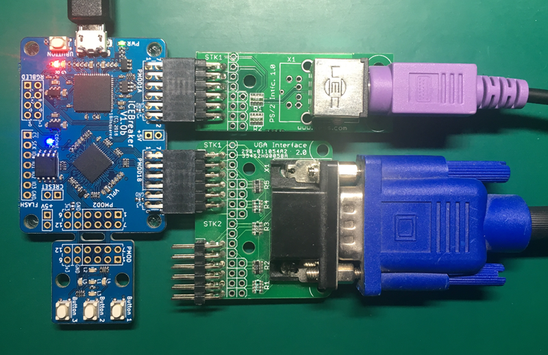
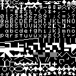

# up5k_vga for IceBreaker FPGA board
This version is a fork of Emeb's (Eric Brombaugh's) https://github.com/emeb/up5k_vga
slightly modified to work with the IceBreaker FPGA board
(https://www.crowdsupply.com/1bitsquared/icebreaker-fpga) and VGA PMOD and PS/2 PMOD
adapters.

For UART only use, you don't need any PMODs and can use stock IceBreaker (and likely other UPK5 boards).

For VGA and PS/2, I used Xess "StickIt!" VGA PMOD and Xess "StickIt!" PS/2 PMOD
adapters.
See http://www.xess.com/shop/product/stickit-vga/ and http://www.xess.com/shop/product/stickit-ps2/ but they aren't available for sale.
I like these, since you can get 64 VGA colors from a single PMOD port and PS/2 adapter is nice physical size.
However since these PMODs are difficult to obtain you can also change I/O definitions for other VGA and PS/2 PMODs (e.g., Digilent).

  
This is a picture of my IceBreaker (prototype) with PMODs running up5k_vga.

*Below is Emeb's origianl README (with a few IceBreaker notes added):*

# up5k_vga
A complete 65C02 computer with VGA output on a Lattice Ultra Plus FPGA.

It is based on https://github.com/emeb/up5k_basic with VGA instead of NTSC
composite video and has been upgraded to a 65C02 CPU core.

This system includes the following features:

* Up to 52kB SRAM with optional write protect (using two of the four available SPRAM cores)
* 8 bits input, 8 bits output
* 115200bps serial I/O port
* 800x600 60Hz 64 color VGA with text/glyph, 16-color medium rez, 2 color hi-rez,
32kB video RAM (2 16kB pages) and original OSI 2kB character ROM
* 2kB ROM for startup and I/O support
* 8kB Ohio Scientific C1P Microsoft BASIC loaded from spi flash into protected RAM
* SPI port with access to external flash memory
* LED PWM driver (NOTE: Untested on IceBreaker)
* PS/2 Keyboard port with tx and rx capability
* 4-voice sound generator with 1-bit sigma-delta output (NOTE: Not on IceBreaker - yet)

## prerequisites
To build this you will need the following FPGA tools

* Icestorm - ice40 FPGA tools
* Yosys - Synthesis
* Nextpnr - Place and Route (version newer than Mar 23 2019 is needed to support IP cores)

Info on these can be found at http://www.clifford.at/icestorm/

You will also need the following 6502 tools to build the startup ROM:

* cc65 6502 C compiler (for default option) https://github.com/cc65/cc65

## Building

	git clone https://github.com/XarkLabs/up5k_vga.git
	cd up5k_basic
	git submodule update --init
	cd icestorm
	make

Note: It is not unusual for the make process to fail due to missed timing
constraints on the 40MHz pixel clock. This is generally not a serious problem
due to pessimistic timing parameters in the Icestorm tools. Simply rerun "make"
to complete the build.

NOTE: For IceBreaker board there are some added build targets:

	make icebprog		# build and program FPGA SPI configuration flash
	make icebroms		# program OSI BASIC rom to SPI flash
	make icedemos		# combine BASIC demo progrems and program to SPI flash
	make icebprogall	# all three of the above
	make icebextract	# read SPI flash from FPGA and extract saved BASIC programs

## Loading

I built this system on a custom up5k board and programmed it with a custom
USB->SPI board that I built so you will definitely need to tweak the programming
target of the Makefile in the icestorm directory to match your own hardware.
Note that the 8kB BASIC ROM must now be loaded into the SPI configuration
flash memory starting at offset 0x40000 in order for BASIC to run correctly.
You can find a link to the ROM data at the end of this document.

## Booting up

You will need to connect a PS/2 keyboard to the ps2_clk/dat pins, or a
115200bps serial terminal port to the TX/RX pins of the FPGA - the data input
routines can take characters from either or both. Load the bitstream an you'll
see the boot prompt:

    D/C/W/M?

This is asking which initial service to start.

* D - diagnostics. Currently unused, just enters an infinite loop.
* C - Cold start BASIC. This is what you'll normally want.
* W - Warm start BASIC. Use this only after BASIC has been running and the system has been reset.
* M - Machine Language Monitor.

Hit the key of choice (upper or lower case) to continue.

## Running BASIC

After hitting "C", BASIC will initialize. It will prompt you:

    MEMORY SIZE?

to which you answer with 'enter' to let it use all memory. It then prompts
with:

    TERMINAL WIDTH?

Again, hit 'enter' to use the default. It then prints a welcome message and
is ready to accept BASIC commands and code. You can find out more about
how to use this version of BASIC here: https://www.pcjs.org/docs/c1pjs/

## Enhancements to BASIC

I've upgraded the LOAD and SAVE commands in BASIC from the original bare-bones
features found in the OSI ROMs which were intended for simple audio tape
storage. Now, LOAD/SAVE operate on "slots" of up to 32kB stored in the SPI
Flash memory connected to the FPGA. Use LOAD [n] or SAVE [n] where [n] is an
integer from 0-99 that refers to the memory slot in which you wish to save
or load your BASIC program. 

Memory slots contain raw ASCII text of the programs (un-tokenized), so you
could conceivably pre-load the SPI Flash with code from an external source.
Slots start at 0x050000 in the flash memory space and are spaced every 0x8000.
Program text is terminated with 0xFF, so just leave unused bytes in the
default erased state.

The BASIC line input routine has been patched to allow use of the the Backspace
key instead of the underline character. The video text output driver has also
been improved to support proper backspacing.

## C'MON Machine Language Monitor

C'MON is a simple hex machine language monitor for the 6502 written by
Bruce Clark and placed in the public domain which allows examining and
editing memory contents as well as executing machine code.

Answering "M" to the boot prompt will print a quick help header and start
the C'MON monitor.

## Boot ROM

The 2kB ROM located at $f800 - $ffff contains the various reset/interrupt
vectors, initialization code, the C'MON monitor and I/O routines needed to
load and support BASIC.

You can revise this ROM with your own additional support code - you may need
to edit the linker script to change the memory sizes. The cc65 assembler and
linker are required to put it all together into the final .hex file needed by
the FPGA build.

## Serial I/O

Parameters are fixed at 115200bps 8/N/1 but the data rate can be easily
changed over a wide range with simple tweaks to parameters in the acia.v file.

NOTE: When "uploading" BASIC programs over serial, you generally need a delay
at the end of each line (I found 100ms to work nicely in GtkTerm). If you still
have trouble, try reducing baud rate to 9600 in "src/acia.v".

## Video

This is an 800x600 60Hz (40MHz pixel clock[*]) design that seems to work well
with most standard analog VGA monitors. Features are:

* 100x75 text/glyph mode using the OSI 8x8 character generator
* Separate foreground / background colors per-character in text/glyph mode from
a user-defined 16-color map with 64 possible colors for each entry.
* 200x150 16-color medium resolution graphic mode
* 400x300 2-color high resolution graphic mode
* 2 16kB memory pages

[*] NOTE: For IceBreaker 40Mhz pixel clock is actually 39.75Mhz due to limitations
using PLL with source 12Mhz clock.  This was close-enough on LCD monitors I tested. 

NOTE: For IceBreaker I swapped the "}" and "|" characters in the OSI font as they
didn't match the normal ASCII order (annoying when using UART).  It is still a bit
weird, with a "divide" symbol where tilde ("~") shouold be and the tilde where DEL
should be (at 0x7f).

VGA signal is generated with a 2-bit DAC per R/G/B component as well as the
horizontal and vertical sync signals driven directly from the FPGA.

## PS/2 Keyboard

A PS/2 keyboard port is provided which (along with the ACIA) feeds the ASCII
input. Host to keyboard communication is supported and the caps lock LED should
toggle on/off to indicate status.

NOTE: On IceBreaker I changed the Caps-Lock to default to enabled (since OSI BASIC
doesn't understand lowercase commands.)

## Reset

An active-low "soft" reset input will reset the 6502 system without reconfiguring
the FPGA. This will return the system the the "D/C/W/M" prompt and allow a warm-
start into BASIC for recovery from some situations.

NOTE: For IceBreaker reset is mapped to "UBUTTON".

## SPI Flash

The iCE40 Ultra Plus features two SPI and two I2C ports as hard IP cores that
are accessible through a "system bus" that's similar to the popular Wishbone
standard. I've added a 6502 to Wishbone bridge mapped to addresses $F100-$F1FF
which provides access to all four cores. Currently only the SPI core at
addresses $F106-$F10F is connected and it is used to read the BASIC ROM from
flash into SPRAM and support LOAD and SAVE operations.

## LED PWM

Many FPGAs in the iCE40 family provide hard IP cores for driving RGB LEDs. A
simple interface to this is provided so the 6502 may control the LED driver.

NOTE: Untested on IceBreaker.

## Sound Generator

A 4-voice sound generator is provided which supports pitch from 0-32kHz in 
roughly 0.5Hz steps, choice of waveform (saw/square/triangle/noise) and
volume control on each voice. Output is via a 1-bit sigma-delta process
which requires a simple 1-pole RC filter (100ohm + 0.1uf) lowpass filter
to smooth the digital pulse waveform down to analog audio.

NOTE: Not implemented on IceBreaker - yet.

## GPIO for LEDs and buttons (on IceBreaker)

IceBreaker maps 65C02 GPIO to the 5 LEDs and 3 buttons on the built in PMOD 2.
You can set the LEDs from BASIC by poking the low 5 bits of 61952 ($F200) or
read the buttons by peeking the low 3 bits 61952 ($F200).

For example, to control 3 of the LEDs with the 3 buttons from OSI BASIC:

	10 POKE 61952,PEEK(61952)
	20 GOTO 10

## Simulating

Simulation is supported and requires the following prerequisites:

* Icarus Verilog simulator http://iverilog.icarus.com/
* GTKWave waveform viewer http://gtkwave.sourceforge.net/

To simulate, use the following commands

	cd icarus
	make
	make wave

This will build the simulation executable, run it and then view the output.

## Copyright

There have been questions raised about the copyright status of the MS BASIC
provided in this project. To the best of my knowledge, the contents of the file
src/basic_8k.hex is still property of Microsoft and is used here for educational
purposes only. The full source code for this can be found at:

https://github.com/brajeshwar/Microsoft-BASIC-for-6502-Original-Source-Code-1978

The ROM files from which I created the .hex file are also available in many
places - I used this archive: http://www.osiweb.org/misc/OSI600_RAM_ROM.zip

[ NOTE from Xark: For your convienience I have put "osibasic.rom" in this repo (for educational
purposes only).  It is the "Fixed BASIC3 ROM" from https://www.osiweb.org/software.html
that corrects the crippling garbage collection bug from the original OSI ROM.
See https://www.pagetable.com/?p=46 for many Microsoft BASIC details. ]

## Thanks

Thanks to the developers of all the tools used for this, as well as the authors
of the IP core I snagged for the 65C02. I've added that as a submodule
so you'll know where to get it and who to give credit to.

NOTE From Xark: Thanks to Emeb for putting this where I could play with it!
Also thanks to Piotr Esden-Tempski for making the IceBreaker board (and letting
me get an early version at his HackADay Supercon 2018 hands-on FPGA session).
